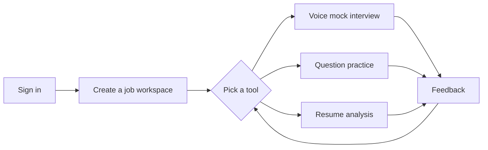
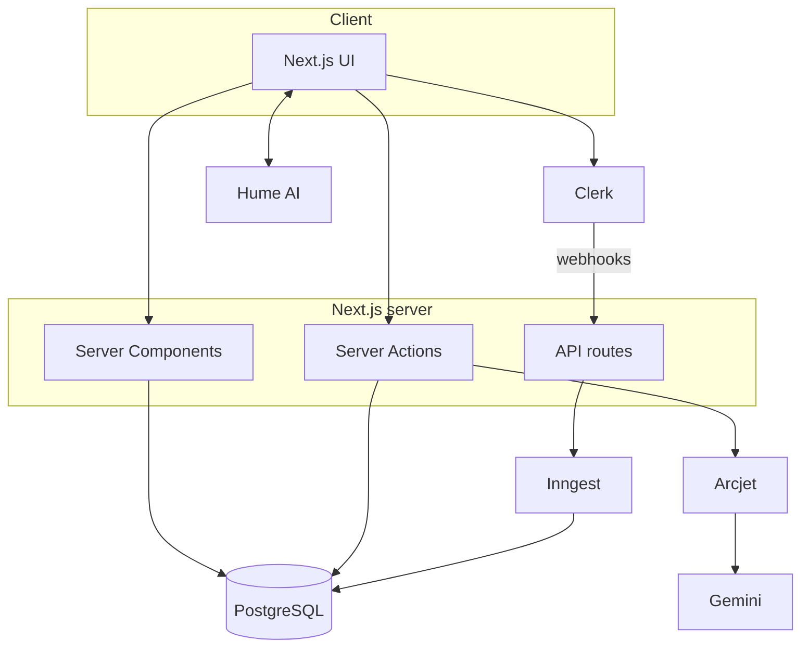
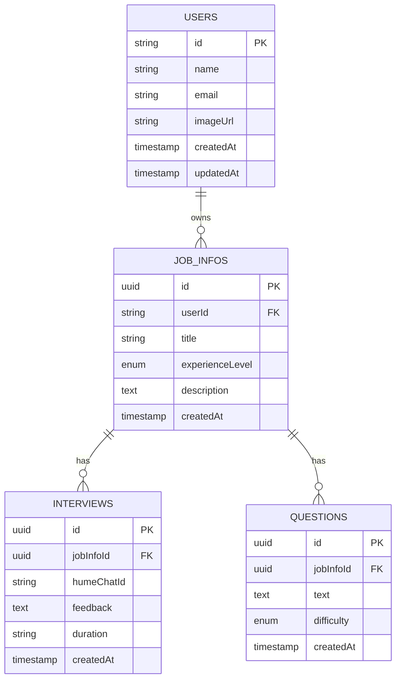

<div align="center">


<br />

# AI-Powered Job Preparation & Interview Platform

A web app for practicing interviews against a specific job description, with voice mock interviews, technical question practice and resume analysis.

<br />


[Features](#features) | [Tech Stack](#tech-stack) | [Getting Started](#getting-started) | [Roadmap](#roadmap) | [Contributing](#contributing)

</div>

---

## Table of Contents

1. [About](#about)
2. [Screenshots](#screenshots)
3. [Features](#features)
4. [How It Works](#how-it-works)
5. [Tech Stack](#tech-stack)
6. [Architecture](#architecture)
7. [Project Structure](#project-structure)
8. [Database Schema](#database-schema)
9. [Getting Started](#getting-started)
10. [Environment Variables](#environment-variables)
11. [Scripts](#scripts)
12. [Security](#security)
13. [Roadmap](#roadmap)
14. [Contributing](#contributing)
15. [Troubleshooting](#troubleshooting)
16. [License](#license)
17. [Author](#author)

---

## About

Most interview prep material is generic. A list of "top 50 questions" doesn't tell you much when you are applying for one particular role, and practicing alone means nobody tells you how you did.

This project lets you create a workspace for a job you are applying to by pasting in the job description, your target title and your experience level. Everything the app generates after that is based on that job:

- A spoken mock interview with an AI interviewer
- Technical questions at different difficulty levels, with feedback on your answers
- An analysis of your resume against the job description

It is meant for students, fresh graduates, people changing careers, and anyone who wants a low-pressure way to practice before the real thing. It is also a reasonably complete example of a full-stack AI app built with the Next.js App Router.

---

## Screenshots

Put your screenshots in `docs/screenshots/` and update the file names below.

| Dashboard | Mock Interview |
| :---: | :---: |
|  |  |

| Question Practice | Resume Analysis |
| :---: | :---: |
|  |  |

---

## Features

### Accounts
- Sign up and sign in with Clerk
- User records are synced to the database through webhooks
- Every route in the app is protected, and users only see their own data

### Job workspaces
- Create one workspace per job, with a title, experience level and the full job description
- All AI features use that workspace as context
- Keep several applications side by side

### Voice mock interviews
- Talk to an AI interviewer in real time using Hume AI's voice interface
- Questions come from the job description and your experience level
- The interviewer asks follow-up questions based on what you say
- After the session you get written feedback covering strengths, weak spots, communication and technical depth
- Past interviews are saved so you can look back at them

### Technical question practice
- Generate questions at easy, medium or hard difficulty
- Type your answer and get it evaluated by the AI
- Each answer comes back with a score, feedback and a sample answer
- Generate more questions for the same job whenever you want

### Resume analysis
- Upload your resume and compare it against the job description
- The report covers ATS compatibility, how well your experience matches the job, writing quality and structure
- Suggestions are ordered by how much they are likely to matter

### Other details
- Rate limiting and bot protection on the AI endpoints
- Long-running work (like webhook processing) runs in background jobs
- Input is validated with Zod
- Responsive layout with light and dark themes

---

## How It Works



1. Create a workspace and paste in the job description.
2. Choose a mode: voice interview, question practice or resume analysis.
3. The app sends the job details (and your resume, if relevant) to the AI as context.
4. You answer by voice or by typing.
5. You get feedback and can go again.

---

## Tech Stack

| Area | Technology |
| --- | --- |
| Framework | [Next.js 15](https://nextjs.org/) (App Router, Server Components, Server Actions) |
| Language | [TypeScript](https://www.typescriptlang.org/) |
| Styling | [Tailwind CSS v4](https://tailwindcss.com/) |
| UI components | [shadcn/ui](https://ui.shadcn.com/) and [Radix UI](https://www.radix-ui.com/) |
| Authentication | [Clerk](https://clerk.com/) |
| Database | [PostgreSQL](https://www.postgresql.org/) on [Neon](https://neon.tech/) |
| ORM | [Drizzle ORM](https://orm.drizzle.team/) |
| Text AI | [Google Gemini](https://ai.google.dev/) through the [Vercel AI SDK](https://sdk.vercel.ai/) |
| Voice AI | [Hume AI](https://www.hume.ai/) |
| Background jobs | [Inngest](https://www.inngest.com/) |
| Security | [Arcjet](https://arcjet.com/) |
| Validation | [Zod](https://zod.dev/) |

---

## Architecture



How the code is organized:

- Code is grouped by feature (job info, interviews, questions, resume), and each feature keeps its own actions, components and database queries.
- Data is loaded in Server Components, and changes go through Server Actions.
- Types flow from the Drizzle schema through Zod validation to the UI.
- Webhook and AI work is kept separate from the main request path so a failure there does not take down the page.

---

## Project Structure

This tree is a guide. Update it so it matches the repository.

```
.
├── assets/
│   └── banner.svg
├── docs/
│   └── screenshots/
├── public/
├── src/
│   ├── app/
│   │   ├── (auth)/
│   │   ├── (dashboard)/
│   │   │   └── app/job-infos/[jobInfoId]/
│   │   │       ├── interviews/
│   │   │       ├── questions/
│   │   │       └── resume/
│   │   ├── api/
│   │   │   └── inngest/
│   │   ├── layout.tsx
│   │   └── page.tsx
│   ├── components/
│   │   └── ui/
│   ├── drizzle/
│   │   ├── schema/
│   │   ├── migrations/
│   │   └── db.ts
│   ├── features/
│   │   ├── jobInfos/
│   │   ├── interviews/
│   │   ├── questions/
│   │   └── users/
│   ├── services/
│   │   ├── ai/
│   │   ├── clerk/
│   │   ├── hume/
│   │   └── inngest/
│   ├── lib/
│   ├── data/env/
│   └── middleware.ts
├── drizzle.config.ts
├── next.config.ts
├── package.json
└── .env.example
```

---

## Database Schema



---

## Getting Started

### Prerequisites

- Node.js 20 or newer
- npm, pnpm or yarn
- Git
- Accounts and API keys for Clerk, Neon (or any PostgreSQL database), Google AI Studio, Hume AI, Inngest and Arcjet

### 1. Clone the repository

```bash
git clone https://github.com/avi-nash-0211/AI-Powered-Job-Preparation-Interview-Platform.git
cd AI-Powered-Job-Preparation-Interview-Platform
```

### 2. Install dependencies

```bash
npm install
```

### 3. Set up environment variables

```bash
cp .env.example .env
```

Fill in every value. The full list is in [Environment Variables](#environment-variables).

### 4. Set up the database

```bash
npm run db:push
```

To look at the data in a browser:

```bash
npm run db:studio
```

### 5. Start the Inngest dev server

In a second terminal:

```bash
npx inngest-cli@latest dev
```

### 6. Start the app

```bash
npm run dev
```

Open http://localhost:3000.

### 7. Clerk webhooks (local development)

To get new users into your local database, point a Clerk webhook at your local Inngest endpoint through a tunnel such as ngrok. Subscribe to the `user.created`, `user.updated` and `user.deleted` events.

---

## Environment Variables

Create a `.env` file in the project root:

```env
# Database
DB_HOST=
DB_PORT=5432
DB_USER=
DB_PASSWORD=
DB_NAME=

# Clerk
NEXT_PUBLIC_CLERK_PUBLISHABLE_KEY=
CLERK_SECRET_KEY=
CLERK_WEBHOOK_SECRET=
NEXT_PUBLIC_CLERK_SIGN_IN_URL=/sign-in
NEXT_PUBLIC_CLERK_SIGN_UP_URL=/sign-up

# Google Gemini
GEMINI_API_KEY=

# Hume AI
HUME_API_KEY=
HUME_SECRET_KEY=
NEXT_PUBLIC_HUME_CONFIG_ID=

# Inngest
INNGEST_EVENT_KEY=
INNGEST_SIGNING_KEY=

# Arcjet
ARCJET_KEY=
```

Do not commit `.env`. Make sure it is in `.gitignore`.

| Variable | Used for |
| --- | --- |
| `DB_*` | PostgreSQL connection |
| `NEXT_PUBLIC_CLERK_PUBLISHABLE_KEY` | Clerk, browser side |
| `CLERK_SECRET_KEY` | Clerk, server side |
| `CLERK_WEBHOOK_SECRET` | Verifying Clerk webhooks |
| `GEMINI_API_KEY` | Questions, feedback and resume analysis |
| `HUME_API_KEY`, `HUME_SECRET_KEY` | Authenticating the voice interviewer |
| `NEXT_PUBLIC_HUME_CONFIG_ID` | Voice configuration |
| `INNGEST_*` | Background jobs |
| `ARCJET_KEY` | Rate limiting and bot protection |

---

## Scripts

| Command | What it does |
| --- | --- |
| `npm run dev` | Start the dev server |
| `npm run build` | Build the app |
| `npm run start` | Start the built app |
| `npm run lint` | Run the linter |
| `npm run db:generate` | Generate migrations from the schema |
| `npm run db:migrate` | Apply migrations |
| `npm run db:push` | Push the schema straight to the database |
| `npm run db:studio` | Open Drizzle Studio |

Check `package.json` for the exact script names in this repo.

---

## Security

- Clerk middleware protects every authenticated route
- Arcjet handles rate limiting, bot detection and common attack patterns
- User input is validated with Zod
- Database queries are scoped to the signed-in user
- Secrets only live on the server, and only `NEXT_PUBLIC_*` values reach the browser

If you find a vulnerability, please report it through a private security advisory on GitHub rather than a public issue.

---

## Roadmap

- [x] Authentication and user sync
- [x] Job workspaces
- [x] Voice mock interviews
- [x] Technical question practice
- [x] Resume analysis
- [ ] Behavioral interview mode (STAR method)
- [ ] Company-specific preparation
- [ ] Progress charts across sessions
- [ ] Downloadable PDF reports
- [ ] In-browser coding round
- [ ] More interview languages

If you have a suggestion, [open an issue](https://github.com/avi-nash-0211/AI-Powered-Job-Preparation-Interview-Platform/issues/new).

---

## Contributing

Contributions are welcome.

1. Fork the repository
2. Create a branch: `git checkout -b feature/your-feature`
3. Commit your changes: `git commit -m "feat: describe your change"`
4. Push the branch: `git push origin feature/your-feature`
5. Open a pull request

Commit messages follow [Conventional Commits](https://www.conventionalcommits.org/) (`feat:`, `fix:`, `docs:`, `refactor:`, `chore:`).

Before opening a pull request, run `npm run lint` and `npm run build`, keep types strict (no `any`), and validate any new input with Zod.

---

## Troubleshooting

**The app won't start and complains about environment variables.**
Check that every variable from `.env.example` is present in `.env`, then restart the dev server.

**New users don't show up in the database.**
User sync goes through Clerk webhooks and Inngest. Make sure the Inngest dev server is running, the webhook URL is correct, and `CLERK_WEBHOOK_SECRET` matches.

**The voice interview doesn't start.**
Allow microphone access in your browser and double-check your Hume keys and config ID.

**I get "Too Many Requests".**
Arcjet is rate limiting the endpoint. Wait a bit and try again, or adjust the limits in the Arcjet config.

**Database connection errors.**
Check the `DB_*` values and that your Neon project is not suspended. Some providers require SSL.

---

## License

Released under the MIT License. See [LICENSE](./LICENSE) for details.

---

## Author

Avinash

- GitHub: [@avi-nash-0211](https://github.com/avi-nash-0211)
- LinkedIn: `https://linkedin.com/in/your-profile`
- Email: `your-email@example.com`

If you find this project useful, a star on the repository is appreciated.
